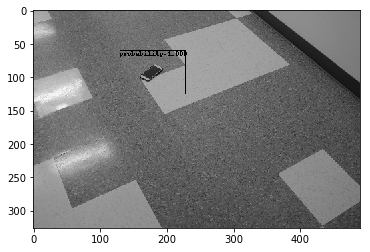

# Object detection

* Prediction Accuracy: **96.15%**

---
## Train phone detection


```python
# sources
from PIL import Image, ImageEnhance
from sklearn.linear_model import LogisticRegression
from sklearn.model_selection import train_test_split 

# libraries
import numpy as np
import pandas as pd
import matplotlib.pyplot as plt
import os
import glob
import sys
import cPickle
import random
import cv2

```


```python
# helpers
def matrix_transform(images):
    return np.array([np.array(img).flatten() for img in images])

def normalized_coords(data_frame, image_basename):
    img = data_frame[data_frame['image'] == image_basename]
    x_norm, y_norm = float(img['x']), float(img['y'])
    return x_norm, y_norm

def display(y_predict_test, samples=10):
    plt.figure(figsize=(15,8.5))
    for index, (image, label) in enumerate(y_predict_test[:samples]):
        plt.subplot(1, samples, index + 1)
        plt.axis('off')
        plt.imshow(np.array(image), cmap='gray')
        plt.title('1' if label == 'Yes' else '0')
    plt.show()

# image preprocessing
def image_preprocessing(img_folder, split_ratio=0.2):
    img_path = glob.glob(img_folder + '/*.jpg') 
    training_images = img_path[:int((1-split_ratio)*len(img_path))]
    testing_images = img_path[int((1-split_ratio)*len(img_path)):]
    with open('testing_images.cPickle', 'wb') as fo:
        cPickle.dump(testing_images, fo)
    return training_images, testing_images
    
def create_box(image, x_norm, y_norm, box_size_norm, width=40, height=40):
    x_top_left = (x_norm - box_size_norm)*image.size[0]
    y_top_left = (y_norm - box_size_norm)*image.size[1]
    x_bottom_right = (x_norm + box_size_norm)*image.size[0]
    y_bottom_right = (y_norm + box_size_norm)*image.size[1]
    box = map(int, (x_top_left, y_top_left, x_bottom_right, y_bottom_right))
    return box, image.crop(box).resize((width, height))

def object_extraction(img_folder, img_path, box_size_norm):
    data_frame = pd.read_table(img_folder + '/labels.txt', sep=' ', names=['image','x','y'])
    extracted_samples = []
    for img in img_path:
        image = Image.open(img).convert('L') # grayscale
        image_basename = os.path.basename(os.path.normpath(img))
        x_norm, y_norm = normalized_coords(data_frame, image_basename)
        _, frame = create_box(image, x_norm, y_norm, box_size_norm)
        extracted_samples += [(frame, 'Yes')]
        _, frame = create_box(image, random.random(), random.random(), box_size_norm)
        extracted_samples += [(frame, 'No')]
    return extracted_samples

def labeled_extraction(img_folder, box_size_norm=0.1):
    with open('box_size_norm.cPickle', 'wb') as fo:
        cPickle.dump(box_size_norm, fo)
    training_images, testing_images = image_preprocessing(img_folder)
    training_labels = object_extraction(img_folder, training_images, box_size_norm)
    testing_labels = object_extraction(img_folder, testing_images, box_size_norm)
    return training_labels, testing_labels
    
# train model
def train_model(X_train, y_train, clf = LogisticRegression(), model='model.cPickle'):
    clf.fit(X_train, y_train)
    with open(model, 'wb') as fo: # save the model
        cPickle.dump(clf, fo)
    
# test model
def test_model(X_test_set, x_test, model='model.cPickle'):
    with open(model, 'rb') as file_in:
        classifier = cPickle.load(file_in)
    yhat_testing = classifier.predict(X_test_set)
    display(zip(x_test, yhat_testing))
    
# run the model
def run_test_model(img_folder):
    training_images, testing_images = labeled_extraction(img_folder)
    X_train, y_train = zip(*training_images)
    X_test, y_test = zip(*testing_images)
    X_train_set, X_test_set = matrix_transform(X_train), matrix_transform(X_test)
    train_model(X_train_set, y_train)
    test_model(X_test_set, X_test)
    
# if __name__ == '__main__':
img_folder = 'find_phone'
run_test_model(img_folder) # sys.argv[1]


```


---
## Find phone 


```python
# libraries
from PIL import Image, ImageDraw
# from train_phone_finder import create_box, normalized_coords
import matplotlib.pyplot as plt
import numpy as np
import cPickle
import sys
import cv2


```


```python
def frame_coords(box_size_norm, num_frames):
        return np.linspace(box_size_norm, 
                           1.0 - box_size_norm, 
                           num_frames)
        
def frame_generator(img, width_frame=40, height_frame=40):
    with open('box_size_norm.cPickle', 'rb') as fi:
        box_size_norm = cPickle.load(fi)
    for coord_x in frame_coords(box_size_norm, width_frame):
        for coord_y in frame_coords(box_size_norm, height_frame):
            box, frame = create_box(img, coord_x, coord_y, box_size_norm)
            yield coord_x, coord_y, box, frame

# scan the object 
def scan_object(img_path, display_img=False):
    
    image = Image.open(img_path).convert('L') # grayscale
    coord_x, coord_y, boxes, frames = zip(*frame_generator(image)) # flip rc to cr
    # load the model
    with open('model.cPickle', 'rb') as fi:
        clf = cPickle.load(fi)
    matrix_transform = np.array([np.array(img).flatten() for img in frames])
    object_probability = clf.predict_proba(matrix_transform)[:,1]
    arg_max = np.argmax(object_probability)
    if display:
        draw_img = ImageDraw.Draw(image)
        bounding_box = boxes[arg_max]
        draw_img.rectangle(bounding_box)
        draw_img.text((bounding_box[0], bounding_box[1]), 'probability=%.3f' % object_probability[arg_max])
        plt.imshow(np.array(image), cmap='gray')
        plt.show()
    return coord_x[arg_max], coord_y[arg_max]
    
def accuracy(img_folder='find_phone'):
    data_frame = pd.read_table(img_folder + '/labels.txt', sep=' ', names=['image','x','y']) 
    with open('testing_images.cPickle','rb') as fi:
        testing_images = cPickle.load(fi)
    radius = 0.05
    num_false_negative = 0
    num_true_positive = 0
    for img_path in testing_images:
        img_file = os.path.basename(os.path.normpath(img_path))
        x_correct, y_correct = normalized_coords(data_frame, img_file)
        x_predict, y_predict = scan_object(img_path, display_img=False)
        diff_x, diff_y = x_predict-x_correct, y_predict-y_correct
        if np.sqrt(diff_x**2 + diff_y**2) < radius: num_true_positive+=1
        else: num_false_negative +=1
    print('Accuracy of predicting the object: %.3f' % \
          (num_true_positive *100 /float(num_true_positive + num_false_negative)))

accuracy()
```





    Accuracy of predicting the object: 96.154


# Accuracy of predicting the object: 96.154


```python
imgPath = 'find_phone/51.jpg'
print(scan_object(imgPath, display_img=True))
```


    (0.24358974358974358, 0.61282051282051275)


## Disclaims:
Credit to:

https://github.com/samuel413230/find_iphone and https://github.com/petermchale/find_phone.

The above approaches only achieved around **83% to 85%** accuracy.

My approach outperformed at **96.15%** accuracy.
